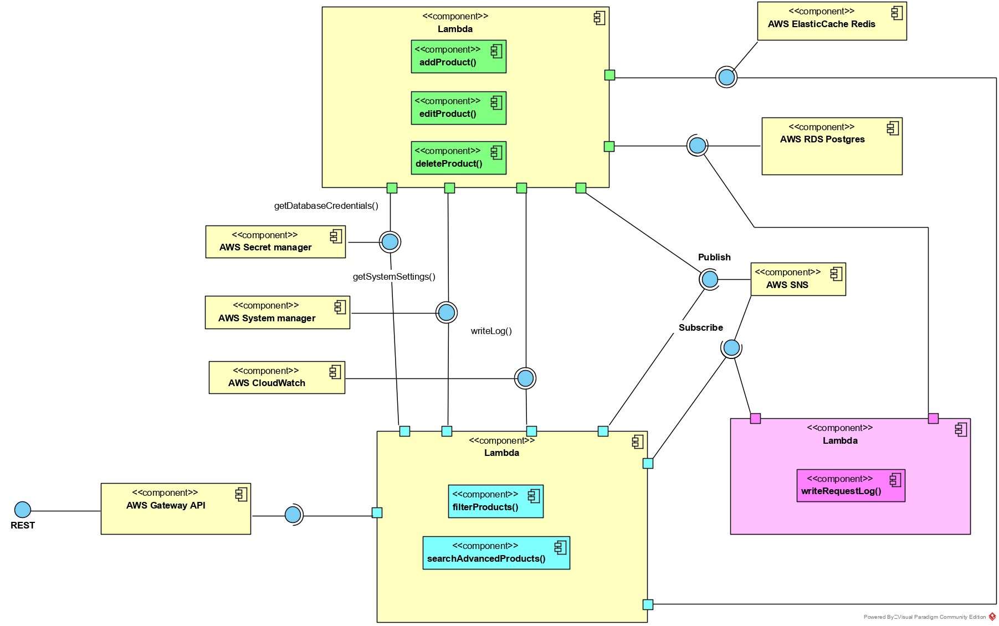

# Serverless documentation

## Component diagram

**Note:** This diagram is what I have in mind. In fact, I didn't have time to implement this architecture.

### Calling APIs

- Import Postman environment for [microservice](./packages/docs/source/NAB-Challenge-Container.postman_environment.json) and [Lambda](./packages/docs/source/NAB-Challenge-Lambda.postman_environment.json) in folder `packages/docs/source`
- Import [Postman collection](./packages/docs/source/NAB-iCommerce.postman_collection.json) in folder `packages/docs/source`
- Select environment **"NAB Challenge - Lambda"**
- Only two APIs `Product > Filter products` and `Product > Advanced search product` are working now.

### Deploying

- Stand at `packages/lambda-product`
- `yarn` to install dependencies
- `bash ./bin/ci-deploy.sh` to deploy
